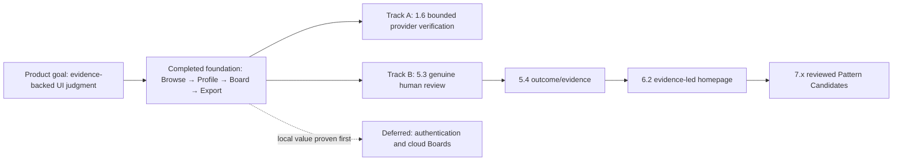

# Tessli V3 — Build Slices

Status: **active delivery plan — V3.4 Canonical Browse focus NEXT**
Rule: one independently reviewable vertical slice per branch and pull request.  
Product direction: `docs/product-realignment-v3.md`

The previous detailed Phase 1 ledger and legacy slice numbers remain available in Git history and under `docs/slices/`. `docs/product-plan-v2.md` is historical evidence; it does not define active or next work. This document preserves completed V2 evidence while using V3 identifiers for new slices.

- completed V2 and legacy `14.x` work remains traceable;
- V3.0 reconciled authority documentation and V3.1 completed public IA hygiene on 2026-08-08;
- V3.2 completed the AccessRoute contract pilot, V3.3 completed the Motion source-guide proof; V3.4–V3.17 are the remaining ordered delivery sequence.

## 1. Mandatory read order

Before changing Tessli:

1. refresh current `main`;
2. read `docs/product-direction.md`;
3. read `PRD.md`;
4. read this file;
5. read `docs/product-realignment-v3.md`;
6. read `AGENTS.md`;
7. read `design.md` for visible work;
8. read relevant contracts, schemas, code, tests, and completed slice evidence.

When documents conflict, resolve the conflict before product implementation continues.

## 2. Required GitHub slice loop

1. Read current `main`.
2. Read the mandatory product and repository documents.
3. Finish any approved in-progress slice before starting another.
4. Create one branch from current `main`.
5. Define exact acceptance criteria, exclusions, and expected files.
6. Implement one vertical slice.
7. Run focused tests and checks.
8. Review the complete diff.
9. Fix findings.
10. Run all applicable CI, browser, accessibility, security, privacy, and data checks.
11. Commit intentionally.
12. Open or update a draft PR.
13. Review the PR diff, review threads, and exact-head CI.
14. Fix final findings.
15. Squash-merge only when gates pass.
16. Delete the branch where tooling permits.
17. Refresh updated `main` before the next slice.

Do not start a later slice from an unmerged feature branch. Development is continued in the active conversation, not through recurring scheduled automation.

One slice uses one short-lived branch and one draft pull request. A branch may not carry a later slice, even when that later work is documentation-only.

## 3. Status legend

- `DONE` — acceptance criteria demonstrated and squash-merged.
- `NEXT` — approved next slice.
- `PLANNED` — defined but not started.
- `PROOF` — requires real workflow evidence.
- `BLOCKED` — safe repository work is complete but an external or human dependency remains.
- `DEFERRED` — intentionally held until prerequisites are met.
- `SUPERSEDED` — old product decision remains in history/code until replaced.

## 4. Global stop conditions

Stop before merge when any of these occur:

- a later phase is mixed into the current slice;
- failed CI, browser, accessibility, security, privacy, data, or release checks are bypassed;
- a source is described as universally best without contextual reasons;
- Listed/Profiled/Verified status is overstated;
- sourced facts, curator judgment, project decisions, and open questions are mixed;
- all 295 records are rendered in one default result document;
- complete mobile and desktop result sets are duplicated;
- fake verification dates, rankings, trends, users, or social proof appear;
- unfinished Sign in, cloud, submission, moderation, or collaboration actions are promoted;
- human-review scores or provider verification are invented;
- paid/private content is copied, proxied, or persisted without permission;
- secrets, service keys, credentials, or personal/client data are exposed;
- private browser-local Board content is uploaded or published;
- a required external dependency is silently treated as completed.

## 5. Completed reusable baseline

Unless an approved slice changes them, Tessli already has:

- a Next.js App Router application and CI/release gates;
- a warm editorial design foundation;
- responsive public shell and legal/content pages;
- a validated 295-source catalogue across 11 categories;
- one canonical paginated `/resources` browser;
- internal source-detail routes for all 295 sources;
- truthful 255 Listed / 40 Profiled / 0 Verified coverage;
- enriched Profiled intelligence detail and explainable Similar Sources;
- resource-media fallbacks and provenance tooling;
- six repository-maintained staged Playbooks;
- browser-local Saved with search, filters, sorting, removal, and undo;
- browser-local project Boards with goals, audience, constraints, source notes, decisions, rationale, and unresolved questions;
- deterministic browser-local Markdown research-pack copy and download;
- deterministic public source and collection Markdown/JSON representations;
- Supabase SSR/client and user-data schema groundwork that remains inactive publicly;
- evidence/profile validation tooling;
- a local context-engine provider;
- deterministic research-plan/reference-packet builders;
- seven read-only native MCP tools.

Completed code is not automatically approval for later-phase functionality. Public auth, cloud workspaces, submissions, moderation, Pattern Candidates, and UI-taste claims remain deferred until their prerequisites are met.

## 6. Active V3 slice status

| ID    | Slice                             | Status   | Depends on              |
| ----- | --------------------------------- | -------- | ----------------------- |
| V3.0  | Authority reconciliation          | DONE     | V3 approval             |
| V3.1  | Public IA hygiene                 | DONE     | V3.0                    |
| V3.2  | AccessRoute contract pilot        | DONE     | V3.0                    |
| V3.3  | Source guide vertical proof       | DONE     | V3.2                    |
| V3.4  | Canonical Browse focus            | NEXT     | V3.2, V3.3              |
| V3.5  | Homepage task entry               | PLANNED  | V3.4                    |
| V3.6  | Resource-card consistency         | PLANNED  | V3.3, V3.4              |
| V3.7  | Deterministic task retrieval      | PLANNED  | V3.2                    |
| V3.8  | Local MCP v2                      | PLANNED  | V3.7                    |
| V3.9  | Public machine representations v2 | PLANNED  | V3.7                    |
| V3.10 | Machine discovery                 | PLANNED  | V3.9                    |
| V3.11 | Collections as research paths     | PLANNED  | V3.3, V3.6              |
| V3.12 | Saved-to-Board flow               | PLANNED  | V3.3, V3.6              |
| V3.13 | Board agent handoff               | PLANNED  | V3.12                   |
| V3.14 | For AI redesign                   | PLANNED  | V3.8–V3.10, V3.13       |
| V3.15 | Live-preview pilot                | DEFERRED | V3.3; separate approval |
| V3.16 | Hosted remote MCP                 | DEFERRED | V3.8–V3.10              |
| V3.17 | Cross-model validation            | DEFERRED | V3.16; provider access  |

The V3 descriptions, acceptance criteria, and exclusions are authoritative in `docs/product-realignment-v3.md`. Do not start a later V3 slice from an unmerged branch.

## 7. Historical V2 phase status

| Phase | Name                                        | Status   | Active/next slice          |
| ----: | ------------------------------------------- | -------- | -------------------------- |
|     0 | Direction Reset                             | DONE     | —                          |
|     1 | Source Intelligence Foundation              | ACTIVE   | 1.6 first Verified batch   |
|     2 | Browse and Source Detail                    | DONE     | —                          |
|     3 | Local Saved and Project Boards              | DONE     | —                          |
|     4 | Research-Pack Export                        | DONE     | —                          |
|     5 | Real OSS Proof Project                      | BLOCKED  | 5.3 human review           |
|     6 | Homepage, Navigation, Playbooks, and For AI | BLOCKED  | 6.2 after Phase 5          |
|     7 | Reviewed Pattern Candidates                 | BLOCKED  | 7.1 after Phase 5          |
|     8 | Authentication and Cloud Workspace          | DEFERRED | 8.1 after local proof      |
|     9 | Community and Moderation                    | DEFERRED | 9.1 after auth/owner       |
|    10 | Evidence-Backed UI-Taste Layer              | DEFERRED | 10.1 after multiple proofs |

## 8. Historical V2 slice status

| ID   | Slice                                                 | Status   | Depends on              | Historical alias/evidence                                              |
| ---- | ----------------------------------------------------- | -------- | ----------------------- | ---------------------------------------------------------------------- |
| 0.1  | Product direction and operating reset                 | DONE     | previous baseline       | legacy `14.0`, PR #74                                                  |
| 0.2  | Execution-track realignment                           | DONE     | 0.1                     | `docs/slices/0.2-execution-track-realignment.md`, PR #95               |
| 0.3  | Documentation reconciliation                          | DONE     | 0.2                     | this documentation-only reconciliation                                 |
| 1.1  | Canonical source-profile contract                     | DONE     | 0.1                     | legacy `14.1`                                                          |
| 1.2  | Coverage mapping and intelligence adapter             | DONE     | 1.1                     | `docs/slices/14.1-source-profile-contract.md`                          |
| 1.3  | Priority source profile expansion — Batch 1           | DONE     | 0.2, 1.2                | `docs/slices/1.3-priority-source-profile-expansion-batch-1.md`, PR #96 |
| 1.4  | Priority source profile expansion — Batch 2           | DONE     | 1.3                     | `docs/slices/1.4-priority-source-profile-expansion-batch-2.md`, PR #97 |
| 1.5  | Verification contract and operator workflow           | DONE     | 1.4                     | `docs/slices/1.5-verification-contract-operator-workflow.md`, PR #98   |
| 1.6  | First evidence-backed Verified batch                  | NEXT     | 1.5                     | —                                                                      |
| 2.1  | Canonical Browse architecture and pagination contract | DONE     | 1.2                     | legacy `14.2`, PR #77                                                  |
| 2.2  | Canonical `/resources` implementation                 | DONE     | 2.1                     | `docs/slices/2.2-canonical-browse-implementation.md`, PR #79           |
| 2.3  | Source Detail foundation for all 295 sources          | DONE     | 1.2, 2.2                | `docs/slices/2.3-source-detail-foundation.md`, PR #80                  |
| 2.4  | Enriched intelligence detail and Similar Sources      | DONE     | 2.3                     | `docs/slices/2.4-enriched-intelligence-detail.md`, PR #81              |
| 3.1  | Universal browser-local Save                          | DONE     | 2.2, 2.3                | `docs/slices/3.1-universal-local-save.md`, PR #82                      |
| 3.2  | Saved workspace search/filter refinement              | DONE     | 3.1                     | `docs/slices/3.2-saved-workspace-refinement.md`, PR #83                |
| 3.3  | Local project Boards and notes                        | DONE     | 3.1, 3.2                | `docs/slices/3.3-local-project-boards.md`, PR #84                      |
| 3.4  | Selected/rejected decisions and unresolved questions  | DONE     | 3.3                     | `docs/slices/3.4-board-decisions.md`, PR #85                           |
| 4.1  | Board research-pack contract                          | DONE     | 3.4                     | `docs/research-pack-contract.md`, PR #86                               |
| 4.2  | Deterministic Markdown export                         | DONE     | 4.1                     | `docs/slices/4.2-deterministic-markdown-export.md`, PR #87             |
| 4.3  | Safe public machine-readable representations          | DONE     | 2.4, 4.2                | `docs/slices/4.3-public-machine-readable-representations.md`, PR #88   |
| 5.1  | OSS proof brief and research Board                    | DONE     | 4.3                     | `docs/slices/5.1-oss-proof-research-setup.md`, PR #89                  |
| 5.2  | Agent implementation from exported pack               | DONE     | 5.1                     | `docs/slices/5.2-oss-homepage-candidate.md`, PR #90                    |
| 5.3  | Browser and human review                              | BLOCKED  | 5.2                     | `docs/slices/5.3-oss-homepage-human-review.md`, PR #91                 |
| 5.4  | Outcome/evidence report                               | BLOCKED  | 5.3 human artifact      | —                                                                      |
| 6.1  | Global navigation and naming cleanup                  | DONE     | 2.2                     | `docs/slices/6.1-global-navigation-cleanup.md`, PR #92                 |
| 6.2  | Curated homepage built around proven workflow         | BLOCKED  | 5.4, 6.1                | —                                                                      |
| 6.3  | Collections-to-playbooks conversion                   | DONE     | 3.3, 4.2                | `docs/slices/6.3-collections-to-playbooks.md`, PR #93                  |
| 6.4  | For AI product page                                   | DONE     | 2.4, 4.3                | `docs/slices/6.4-for-ai-product-page.md`, PR #94                       |
| 7.1  | Pattern Candidate schema                              | PLANNED  | 5.4                     | —                                                                      |
| 7.2  | First 5–10 reviewed candidates                        | PLANNED  | 7.1                     | —                                                                      |
| 7.3  | Pattern retrieval for website/export/MCP              | PLANNED  | 7.2                     | —                                                                      |
| 8.1  | Authentication UX/security contract                   | DEFERRED | Phase 3–5 proof         | —                                                                      |
| 8.2  | Google + email/password + signup verification         | DEFERRED | 8.1, SMTP/OAuth         | —                                                                      |
| 8.3  | Cloud Saved/Boards and local merge                    | DEFERRED | 8.2, RLS review         | —                                                                      |
| 8.4  | Account security, sessions, export, deletion          | DEFERRED | 8.2                     | —                                                                      |
| 9.1  | Submission and correction forms                       | DEFERRED | 8.2, moderation owner   | —                                                                      |
| 9.2  | Moderation workflow and audit state                   | DEFERRED | 9.1                     | —                                                                      |
| 9.3  | Abuse protection and transactional email              | DEFERRED | 9.1, provider setup     | —                                                                      |
| 10.1 | Evaluation and approved-precedent model               | DEFERRED | multiple Phase 5 proofs | —                                                                      |
| 10.2 | Permission-aware precedent retrieval                  | DEFERRED | 10.1                    | —                                                                      |
| 10.3 | Pattern promotion and project design packs            | DEFERRED | 7.3, 10.1               | —                                                                      |
| 10.4 | Repeated outcome evaluation                           | DEFERRED | 10.1–10.3               | —                                                                      |
| 10.5 | Public UI-taste claim review                          | DEFERRED | 10.4                    | —                                                                      |

## 9. Completed V2 evidence

### Phase 0 — Direction Reset

Established Source Index, Research Intelligence, UI Judgment, shared website/export/MCP truth, local value before authentication, and evidence before UI-taste claims.

Evidence: PR #74.

### Slice 0.2 — Execution-track realignment

Separated independent Product Foundation work from the blocked Proof and UI Judgment track. The OSS human-review dependency still blocks Phase 5 outcome work, the evidence-led homepage, Pattern Candidates, and UI-taste claims; it no longer blocks canonical Source Intelligence expansion.

Evidence: `docs/slices/0.2-execution-track-realignment.md`, PR #95.

### Slice 0.3 — Documentation reconciliation

Status: **DONE — documentation-only.**

Reconciled the then-active plan and public component/page contracts with the canonical Browse → Source Detail → Board → Export loop. It preserved completed-slice evidence and recorded **255 Listed / 40 Profiled / 0 Verified** coverage. Its former Slice 1.6 `NEXT` and Slice 5.3 `BLOCKED` declarations are historical, not V3 instructions.

### Phase 1 — Source Intelligence Foundation

Historical status: **ACTIVE before V3.0**

The canonical source-profile schema and deterministic adapter remain complete with the truthful baseline:

```text
255 Listed
40 Profiled
0 Verified
```

The historical continuation proposed moving from the completed verification contract into the first bounded operator-reviewed Verified batch:

```text
1.3  Priority Profile Expansion, Batch 1   DONE      → 265 Listed / 30 Profiled / 0 Verified
1.4  Priority Profile Expansion, Batch 2   DONE      → 255 Listed / 40 Profiled / 0 Verified
1.5  Verification contract/workflow        DONE
1.6  First evidence-backed Verified batch  historical NEXT
```

Selection follows Playbook use, Board/research value, MCP retrieval value, and real OSS workflows—not alphabetical order. Website, representations, MCP, counts, and tests must continue to read the same canonical truth.

Evidence: `docs/slices/14.1-source-profile-contract.md`, PR #76; realignment PR #95; `docs/slices/1.3-priority-source-profile-expansion-batch-1.md`, PR #96; `docs/slices/1.4-priority-source-profile-expansion-batch-2.md`, PR #97; `docs/slices/1.5-verification-contract-operator-workflow.md`, PR #98.

### Phase 2 — Browse and Source Detail

Delivered:

- canonical Browse contract and implementation;
- bounded server-derived pagination;
- URL-restorable query, filters, sorting, view, and page;
- one responsive result tree;
- internal source profiles as the primary destination;
- truthful source-detail routes for all 295 sources;
- progressive Listed/Profiled coverage;
- enriched Profiled capabilities, objects, platforms, frameworks, integrations, formats, tools, governance, and evidence;
- explicit repository-intelligence versus live-provider-verification messaging;
- explainable Similar Sources;
- no popularity, rating, trend, aesthetic, or universal-best scoring.

Evidence:

- `docs/slices/14.2-canonical-browse-contract.md`;
- `docs/slices/2.2-canonical-browse-implementation.md`;
- `docs/slices/2.3-source-detail-foundation.md`;
- `docs/slices/2.4-enriched-intelligence-detail.md`;
- PRs #77, #79, #80, and #81.

### Phase 3 — Local Saved and Project Boards

Delivered:

- universal stable-ID local Save and legacy migration;
- Saved search, filtering, sorting, remove/undo, and clear-all safety;
- Board lifecycle, goals, audience, constraints, source membership, and per-source notes;
- selected, rejected, and undecided state;
- decision rationale separate from research notes;
- editable unresolved questions;
- safe malformed-data fallback;
- same-document and cross-tab synchronization;
- no account, network, cloud, catalogue, schema, or dependency change.

Evidence:

- `docs/slices/3.1-universal-local-save.md`;
- `docs/slices/3.2-saved-workspace-refinement.md`;
- `docs/slices/3.3-local-project-boards.md`;
- `docs/slices/3.4-board-decisions.md`;
- PRs #82–#85.

## 9. Phase 4 — Research-Pack Export

### DONE — Slice 4.1 Board research-pack contract

Defined the versioned `tessli.board-research-pack.v1` contract, including:

- canonical source facts, project judgment, and Tessli interpretation boundaries;
- selected/rejected/undecided and unresolved-question behavior;
- deterministic section/field ordering and explicit date injection;
- UTF-8/LF/one-final-newline rules;
- a twelve-selected-source relevance budget with no silent truncation;
- unknown-source and missing-intelligence fallback without invention;
- bounded evidence and profile arrays;
- provenance, licensing, privacy, and local-only security boundaries;
- deterministic filenames;
- accessible validation, Copy, and Download requirements;
- executable Slice 4.2 tests;
- backward compatibility for the existing MCP packet tool.

Evidence: `docs/research-pack-contract.md`, PR #86.

### DONE — Slice 4.2 Deterministic Markdown export

Delivered:

- one pure `tessli.board-research-pack.v1` formatter with explicit date injection;
- deterministic section, field, Board, profile-array, evidence, filename, line-ending, and final-newline behavior;
- actionable validation for blank identity/goal, invalid date, duplicate IDs, zero selected, and more than twelve selected sources;
- canonical source facts separated from Board notes, rationale, decisions, audience, constraints, and unresolved questions;
- truthful Listed/Profiled and unknown-source fallback without invented intelligence;
- backward-compatible Board audience persistence;
- Copy Markdown and Download `.md` using the same bytes;
- local-only accessible validation, success, and failure states;
- `/boards` route and viewport coverage in the release browser matrix;
- no public route, MCP, account, cloud, provider, dependency, or deployment-state change.

Evidence: `docs/slices/4.2-deterministic-markdown-export.md`, PR #87.

### DONE — Slice 4.3 Safe public machine-readable representations

Delivered:

- deterministic `tessli.public-source.v1` JSON and Markdown for every canonical source;
- deterministic `tessli.public-collection.v1` JSON and Markdown for every published collection;
- one-source and one-collection route families with no bulk all-catalogue endpoint;
- canonical SourceProfile truth and editorial collection ordering;
- truthful Listed/Profiled/Verified and repository-versus-live-verification boundaries;
- UTF-8, LF, stable ordering, two-space JSON, no Markdown trailing whitespace, and one final newline;
- GET, HEAD, and OPTIONS behavior with content type, CORS, cache, `nosniff`, cross-origin resource policy, robots, and canonical/alternate Link headers;
- sitemap and browser-release coverage for source and collection representations;
- no Board, Saved, account, cookie, credential, environment, remote-provider, or private-content exposure;
- no MCP, auth, cloud, catalogue/profile, dependency, Supabase, or deployment-state change.

Evidence: `docs/slices/4.3-public-machine-readable-representations.md`, PR #88.

## 10. Historical V2 phase boundaries

### Operating flow and review roles



- **Terra-high** owns bounded implementation inside the approved slice.
- **Luna-max** independently audits or reviews bounded evidence, contracts, and diffs.
- The **human owner** supplies genuine human-review artifacts and provider-verification evidence; neither can be invented or inferred by an agent.

Keep one slice, one branch, and one draft PR active at a time. Track A may proceed independently; Track B and all downstream UI-Judgment work remain blocked until the required human artifact exists.

### BLOCKED — Phase 5 Real OSS Proof Project

Slice 5.1 delivered a real OSS homepage brief, ten selected references, four rejected directions, a deterministic `tessli.board-research-pack.v1` handoff, locked baseline metrics, and a bounded Slice 5.2 implementation brief. Evidence: `docs/slices/5.1-oss-proof-research-setup.md`, PR #89.

Slice 5.2 delivered one isolated, non-production OSS homepage candidate from the committed pack, retained the first candidate, measured a 35,079-character handoff, recorded a one-hour implementation window, and passed structural, accessibility-tree, overflow, console, touch-target, and five-viewport screenshot checks. Evidence: `docs/slices/5.2-oss-homepage-candidate.md`, PR #90.

Slice 5.3 now has a safe browser-local review workspace, versioned JSON contract, empty reviewer packet/template, focused validation, and five-viewport browser evidence. It is BLOCKED on a genuine completed human-review artifact. Slice 5.4 remains blocked on that artifact and any approved review-driven corrections. Evidence: `docs/slices/5.3-oss-homepage-human-review.md`, PR #91.

### Phase 6 — Homepage, Navigation, Playbooks, and For AI

Slice 6.1 delivered one truthful public shell: Browse and Collections as primary routes, Search and Saved as utilities, About in the footer, no premature Sign in or For AI promotion, and responsive browser evidence. Homepage redesign remains blocked on Phase 5. Collections become staged playbooks next; For AI follows as a working product route. Evidence: `docs/slices/6.1-global-navigation-cleanup.md`, PR #92.

### Phase 7 — Reviewed Pattern Candidates

Start with a schema, then 5–10 genuinely reviewed candidates from real evidence. Do not mass-generate published patterns.

### Phase 8 — Authentication and Cloud Workspace

Begins only after local Boards, export, and proof demonstrate value. OAuth, SMTP, environment separation, RLS, and security review are legitimate blockers.

### Phase 9 — Community and Moderation

Requires contextual forms, server validation, duplicate detection, rate limiting, moderation ownership, audit state, safe errors, and provider readiness.

### Phase 10 — Evidence-Backed UI-Taste Layer

Requires multiple proof projects, permission-aware precedent retrieval, pattern promotion, repeated evaluation, and a final public-claim review. Catalogue size, screenshots, embeddings, or one successful page cannot complete this phase.

## 11. Superseded V2 continuation boundary

The following was the pre-V3 continuation state and is retained only as evidence:

- **Product Foundation:** Phase 1 / Slice 1.6 was `NEXT`. It would have begun the first bounded operator-reviewed Verified batch while preserving the distinction between repository profiling, current provider evidence, and promotion.
- **Proof and UI Judgment:** Slice 5.3 remains BLOCKED on a genuine human-review artifact; Slices 5.4 and 6.2 and Phase 7 remain blocked behind that evidence.

V3.0 replaced this continuation boundary. The next repository slice is **V3.4 Canonical Browse focus**. Verification remains a maintenance and evidence concern, not the next public product milestone. Do not invent provider checks, reuse stale profile fingerprints, store credentials or private provider content, or overstate availability.

No recurring scheduled development task is enabled or permitted for this workflow.
