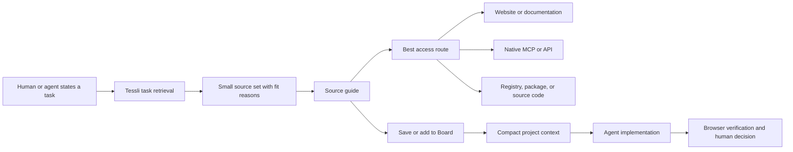

# Tessli V3 — Human-Curated, AI-Native Product Realignment

Status: **active product and execution plan**
Planning slice: **complete**
Authority reconciliation: **V3.0 DONE — 2026-08-08**
Next implementation slice: **V3.9 — Public machine representations v2**

## 1. Product definition

Tessli is a **human-curated, AI-native design-source router**.

It helps a person or coding agent:

1. describe a design or frontend task;
2. find a small relevant set of sources;
3. understand why each source fits;
4. see what can be inspected, installed, learned, or retrieved;
5. choose the best access route: browser, documentation, registry, source code, API, MCP, CLI, or plugin;
6. retain selected and rejected decisions in project context;
7. hand compact context to an agent;
8. build and verify the result.

Tessli is not only a directory, not an iframe browser, not a screenshot warehouse, and not an autonomous taste engine. The public website is the human discovery and curation surface. Static representations and MCP are machine interfaces over the same canonical truth.

## 2. Product promise

For humans:

> Find the right design source, understand what it offers, and keep the useful decisions for your project.

For agents:

> Find the right source for the task, understand why it fits, and know how to access and use it.

Combined:

> Move from a design question to relevant sources, project decisions, implementation context, and browser verification.

## 3. Core product model



### Human interface

- visual, task-led discovery;
- useful source previews;
- concise source guidance;
- differentiated alternatives;
- private Saved and Boards;
- explicit project decisions and export.

### Machine interface

- canonical structured profiles;
- task-fit retrieval;
- explicit access routes;
- compact JSON and Markdown;
- local MCP first, remote MCP after the retrieval contract stabilises;
- model-neutral Board handoff.

### Shared canonical truth

The website, public representations, local MCP, later remote MCP, and exports must derive from the same source and Playbook objects. Presentation may differ, but facts must not.

## 4. Product rules

1. **Task fit before taxonomy.** Categories organise; task intent selects.
2. **Route, do not mirror.** Tessli directs agents to the provider's public website, docs, registry, repository, API, or MCP instead of copying the provider.
3. **Visual for humans, structured for agents.** Preview media helps human evaluation; AI access never depends on an iframe.
4. **Compact default, diagnostic depth on demand.** Routine pages and packets explain value and action. Provenance and operational status remain secondary diagnostics.
5. **Small relevant result sets.** Agent retrieval returns at most eight explained choices, not the entire catalogue.
6. **Project decisions matter.** Selected, rejected, and unresolved decisions are more useful than a pile of saved URLs.
7. **Local privacy first.** Boards stay local until a later cloud slice proves value.
8. **No invented taste.** Alternatives are differentiated by recorded fit, not universal scores.
9. **One vertical slice at a time.** Data contracts, visible redesigns, and remote infrastructure remain separate PRs.

## 5. Global information architecture

### Primary navigation

```text
Browse | Collections | For AI
```

### Personal utilities

```text
Search | Saved | Boards
```

### Footer-only destinations

```text
About | Curation | Privacy | Terms | Content policy
```

### Unpublished until functional

```text
Auth | Submit | Suggest
```

### Internal and unlinked

```text
Lab | Proof candidates | Human-review workspaces
```

## 6. Page-by-page decisions

| Surface               | Decision                               | Primary question                                     | Remove or demote                                                                                           | Add or emphasise                                                                                           |
| --------------------- | -------------------------------------- | ---------------------------------------------------- | ---------------------------------------------------------------------------------------------------------- | ---------------------------------------------------------------------------------------------------------- |
| `/`                   | Rebuild after Browse and Source Detail | What are you trying to design?                       | Duplicate category browser, sort/filter controls, More menu, catalogue-result preview                      | Task search, 3–6 task starters, concise human/agent explanation, selected research paths                   |
| `/resources`          | Keep as the only source browser        | Which sources fit this task?                         | Coverage filter as primary control, audit language, possibly table view if it does not earn its complexity | Task-first search, category/access/type refinement, clear internal Inspect and external Visit actions      |
| `/resources/[slug]`   | Highest-priority redesign              | Should I use this source, and what should I inspect? | Evidence count, human-review status, verification status, raw governance and schema lists                  | Preview, use cases, what to inspect, access routes, limitations, differentiated alternatives, Add to Board |
| `/collections`        | Keep                                   | Which guided research path matches my goal?          | Defensive proof language and excess counts                                                                 | Outcome, audience, stages, expected decision                                                               |
| `/collections/[slug]` | Keep and simplify                      | What should I inspect in what order?                 | Prominent JSON/Markdown actions and internal evidence language                                             | Stage checklist, source role, inspect prompt, decision prompt, Add stage/source to Board                   |
| `/saved`              | Keep                                   | What should I revisit?                               | Account promotion and heavy management UI                                                                  | Search, filter, remove/undo, Add to Board                                                                  |
| `/boards`             | Keep and connect                       | What have I selected, rejected, and decided?         | Disconnected export-only framing                                                                           | Source intake, rationale, decisions, open questions, compact agent handoff                                 |
| `/for-ai`             | Keep; redesign after machine contract  | How can my agent use Tessli?                         | Coverage dashboard, verification exposition, tool inventory first                                          | One workflow, setup paths, example task result, public representations, local/remote availability truth    |
| `/about`              | Keep                                   | What is Tessli and why does it exist?                | Repeated roadmap language                                                                                  | Human-curated AI-native definition and boundaries                                                          |
| `/curation`           | Keep but make operational              | How are sources added and corrected?                 | Public-facing verification bureaucracy                                                                     | Selection principles, update/correction route, quiet provenance policy                                     |
| legal pages           | Keep footer-only                       | What are the actual privacy/content rules?           | Product promotion                                                                                          | Accurate concise policy                                                                                    |
| `/auth`               | Unpublish                              | —                                                    | Disabled sign-in shell                                                                                     | Return only when cloud Boards have real value                                                              |
| `/submit`, `/suggest` | Unpublish                              | —                                                    | Placeholder workflows                                                                                      | Return with real validation and moderation ownership                                                       |
| `/lab/*`, `/proofs/*` | Keep internal                          | —                                                    | Public discovery/navigation                                                                                | `noindex`, unlinked QA and evaluation evidence                                                             |

## 7. Page contracts

### 7.1 Home

Order:

1. short statement of value;
2. task search that submits to `/resources?q=...`;
3. three to six task starters such as SaaS homepage, accessible colour system, component library, typography, motion, and dashboard research;
4. three-step explanation: find sources → keep decisions → give context to an agent;
5. three to six selected Collections;
6. concise For AI pathway;
7. footer.

Do not render a second catalogue, category scroller, sorting, filters, More menu, coverage dashboard, fake usage metrics, or unfinished actions.

The existing Home hero is a preserved product asset. V3.5 may change only the content below it; its copy, artwork, layout, and search interaction stay unchanged.

### 7.2 Browse

Order:

1. task-focused search and result summary;
2. category, source type, access, platform/framework when data supports it;
3. active-filter summary and clear action;
4. paginated result cards or compact list;
5. empty state with query recovery.

Every result must expose:

- source identity;
- one-line purpose;
- two or three high-value task cues;
- preview or resilient fallback;
- internal Inspect action;
- independent Save and Visit actions.

### 7.3 Source guide

Order:

1. breadcrumb;
2. source identity and one-line purpose;
3. approved preview with fixed-ratio fallback;
4. Visit, Save, and Add to Board;
5. `Use it when`;
6. `What to explore`;
7. `How to access it`;
8. `Works with` when useful;
9. `Important limitations`;
10. `Consider instead` with a meaningful differentiator;
11. Collections containing the source;
12. quiet source details and references.

Operational coverage, evidence counts, human-review state, and verification state must not be primary human content.

### 7.4 Collections

Index cards show goal, audience, stage count, and expected outcome. Detail pages show an ordered research checklist. Each source explains its role, what to inspect, and what decision it supports. Save and Add to Board stay available. JSON and Markdown links move to a secondary machine-access area.

### 7.5 Saved and Boards

Saved is a lightweight private shortlist. Boards convert shortlist items into project context:

- project goal;
- audience and constraints;
- selected, rejected, undecided;
- source notes and rationale;
- unresolved questions;
- deterministic Markdown and compact JSON export.

No account or cloud prompt appears until a separate approved persistence slice.

### 7.6 For AI

Order:

1. what Tessli gives an agent;
2. one example task and compact result;
3. access without MCP: semantic pages, JSON, Markdown, Board export;
4. local MCP setup while it is the only MCP transport;
5. remote MCP setup only after it exists;
6. access-route vocabulary;
7. privacy and provider boundaries as concise secondary material.

## 8. Canonical machine contract direction

Introduce one access vocabulary instead of overlapping `integrationMethods` and `agentInterfaces`:

```ts
type AccessRoute = {
  kind:
    | "browser"
    | "documentation"
    | "package-registry"
    | "source-code"
    | "api"
    | "mcp"
    | "cli"
    | "plugin";
  url?: string;
  preferred: boolean;
  auth: "none" | "user" | "unknown";
  agentAction: string;
};
```

Default source output:

```text
What it helps with
When to choose it
What to inspect
How to access it
Important limitation
Closest alternatives and differentiators
Canonical provider URL
```

Provenance, freshness, and governance remain available in an optional diagnostic section. They do not dominate routine human pages or agent packets.

## 9. Preview strategy

### Mode 1 — approved preview

Default for human pages. Use the existing repository-managed Open Graph/manual preview and favicon/letter fallback chain.

### Mode 2 — live preview

Later, optional, allowlisted, sandboxed, and never required. Show only for sources that permit framing and pass security, performance, mobile, and fallback checks.

### Mode 3 — agent access

Never depends on an iframe. Return the canonical URL and preferred AccessRoute so the host agent can use its browser, web-fetch tool, provider MCP, API, registry, or repository access.

## 10. MCP direction

Keep the canonical pure tool layer and read-only boundary. Replace the normal workflow with five focused capabilities:

```text
find_sources
get_source
find_alternatives
get_collection
create_research_brief
```

The v1 tool list is not registered as MCP aliases because every registered stdio tool is necessarily public through `ListTools`; the five-tool contract is the normal and only advertised MCP surface. `verify_resource` moves out of the normal agent workflow. MCP must not read browser-local Boards, browse external providers, proxy private content, or write Tessli state.

Remote Streamable HTTP MCP follows only after task retrieval and compact outputs are stable locally.

## 11. Ordered implementation slices

| ID    | Slice                             | Outcome                                                                                                          | Primary ownership                                              | Depends on              |
| ----- | --------------------------------- | ---------------------------------------------------------------------------------------------------------------- | -------------------------------------------------------------- | ----------------------- |
| V3.0  | Authority reconciliation          | Product direction, PRD, build plan, page/component contracts, README agree on the human-curated AI-native router | Documentation only                                             | DONE                    |
| V3.1  | Public IA hygiene                 | Only useful public routes and navigation remain; placeholders and internal routes are unpromoted/noindex         | Header, footer, sitemap, route metadata                        | V3.0                    |
| V3.2  | AccessRoute contract pilot        | One canonical access vocabulary for ten high-value sources using existing evidence                               | Schema, profile adapter, data fixtures, contract tests         | V3.0                    |
| V3.3  | Source guide vertical proof       | Motion becomes the reference human page and Listed pages degrade honestly                                        | Source Detail page/components/styles, Board action integration | V3.2                    |
| V3.4  | Canonical Browse focus            | Task-first source finding without coverage/audit framing                                                         | `/resources`, Browse controls/cards/tests                      | V3.2, V3.3              |
| V3.5  | Homepage task entry               | Home routes intent into Browse and does not duplicate the catalogue                                              | `/`, home-only components/styles/tests                         | V3.4                    |
| V3.6  | Resource-card consistency         | Preview, Inspect, Save, and Visit behave consistently across Browse, Collections, and Saved                      | Shared resource card/media only                                | V3.3, V3.4              |
| V3.7  | Deterministic task retrieval      | Structured brief returns at most eight sources with reasons, caveats, alternatives, and access routes            | Pure retrieval library/tests                                   | V3.2                    |
| V3.8  | Local MCP v2                      | Five focused read-only tools use the same task retrieval and source truth                                        | MCP catalogue/server/tool tests                                | V3.7                    |
| V3.9  | Public machine representations v2 | Compact action-oriented source/Collection JSON and Markdown                                                      | Representation formatter/routes/tests                          | V3.7                    |
| V3.10 | Machine discovery                 | `robots.txt`, `llms.txt`, sitemap and For AI links make supported interfaces discoverable                        | Metadata routes and discovery tests                            | V3.9                    |
| V3.11 | Collections as research paths     | Guided task stages flow naturally into a Board                                                                   | Collection pages/components/tests                              | V3.3, V3.6              |
| V3.12 | Saved-to-Board flow               | A shortlist can become project decisions without an account                                                      | Saved/Boards/source-to-board components/tests                  | V3.3, V3.6              |
| V3.13 | Board agent handoff               | Compact JSON joins Markdown; model-neutral usage recipe is documented                                            | Board export formatter/UI/tests                                | V3.12                   |
| V3.14 | For AI redesign                   | The page explains the real human-to-agent workflow and current setup truth                                       | `/for-ai` only                                                 | V3.8–V3.10, V3.13       |
| V3.15 | Live-preview pilot                | Allowlisted iframe enhancement for a maximum of three embeddable sources with fallback                           | Source preview component/security tests                        | V3.3; separate approval |
| V3.16 | Hosted remote MCP                 | Public read-only Streamable HTTP facade with limits and monitoring                                               | Server transport/deployment/security                           | V3.8–V3.10              |
| V3.17 | Cross-model validation            | Exact supported setup paths proven with OpenAI, Claude, and Gemini                                               | Integration evidence/docs                                      | V3.16; provider access  |

## 12. Slice acceptance and exclusions

### V3.0 — authority reconciliation

Acceptance:

- authoritative documents use the same product definition;
- verification remains a maintenance concern, not the next public product milestone;
- human, public-web, local-MCP, and later remote-MCP roles are explicit;
- this V3 sequence replaces conflicting `NEXT` declarations.

Exclusions: runtime, schema, data, route, UI, MCP, provider, and deployment changes.

### V3.1 — public IA hygiene

Acceptance:

- every header/footer destination works;
- Auth, Submit, and Suggest are not promoted;
- lab/proof surfaces are unlinked and `noindex`;
- sitemap contains only intended public discovery routes and canonical source/Collection documents.

Exclusions: page redesigns and data changes.

### V3.2 — AccessRoute pilot

Acceptance:

- ten sources cover browser, docs, registry, repository, API/MCP, and CLI examples;
- every route states preferred action and auth boundary;
- website, representations, and MCP adapter consume the same values;
- no provider call occurs during build/test.

Exclusions: crawling, remote MCP, live previews, mass enrichment.

### V3.3 — Motion source guide

Acceptance:

- the first screen answers purpose, use, access, actions, and preview;
- operational audit fields leave the primary reading flow;
- Add to Board works;
- alternatives state differences rather than overlap counts;
- Listed fallback, missing media, empty Collections, keyboard, and 320px states pass.

Exclusions: mass source redesign, new schema, live iframe, Browse/home changes.

### V3.7 — task retrieval

Acceptance:

- deterministic structured input includes task, surface, framework, needs, and exclusions;
- output is at most eight results with explicit fit reasons and caveats;
- ordering is explainable and stable;
- weak metadata degrades honestly.

Exclusions: embeddings, vector database, LLM ranking, public endpoint, remote MCP.

### V3.16 — remote MCP

Acceptance:

- Streamable HTTP wraps the same pure tool layer as local MCP;
- public data only, read-only allowlist, input limits, origin validation, rate limits, safe logs, timeouts, and deployment monitoring exist;
- local MCP remains supported;
- provider compatibility is claimed only after V3.17 evidence.

Exclusions: private Boards, writes, auth accounts, provider proxying, credentials.

## 13. Verification gates

Every visible slice:

- 1440, 1024, 768, 390, and 320px;
- no horizontal overflow;
- keyboard-complete controls and visible focus;
- Escape/focus restoration for sheets, menus, and dialogs;
- 44px touch targets;
- fixed-ratio preview fallback;
- no hover-only meaning;
- save/Board announcements;
- Newsreader, Instrument Sans, warm canvas, charcoal, restrained orange, border-led hierarchy.

Every data or machine slice:

- deterministic output;
- stable IDs/slugs and all 295 catalogue rows preserved;
- website/JSON/Markdown/MCP parity;
- compact output budgets;
- no secrets, remote calls in normal build/test, private Board exposure, or invented metadata;
- focused tests before full format, typecheck, lint, test, catalogue, and build gates.

## 14. Milestones

### First meaningful V3 proof

Complete V3.0–V3.7. A person and a local agent can use the same ten-source truth to answer one task, understand Motion visually, obtain at most eight explained sources, and carry one selection into a Board.

### AI-ready local product

Complete V3.8–V3.14. Local MCP, public representations, discovery files, Board handoff, and For AI present one coherent workflow.

### Cross-model hosted product

Complete V3.16–V3.17. The same read-only retrieval works through supported OpenAI, Claude, and Gemini remote-MCP paths.

## 15. Explicitly deferred

- authentication and cloud Boards;
- submissions and moderation;
- mass live previews or screenshots;
- embeddings and vector search;
- automated aesthetic scoring;
- large pattern catalogues;
- paid-provider proxying;
- team workspaces and billing;
- public UI-taste claims.

## 16. Immediate next slice

Start **V3.9 Public machine representations v2**. It makes the same task-fit source guidance compact and actionable through canonical public JSON and Markdown.
